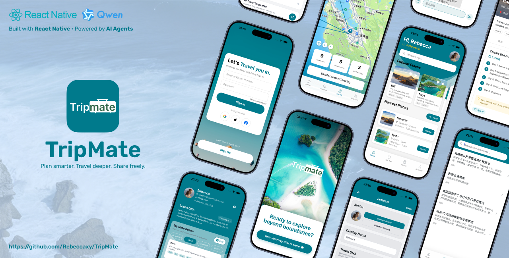

# TripMate

TripMate: A mobile travel planner integrating third-party APIs and an AI agent for personalized itineraries.  
TripMate：一款集成第三方 API 和 AI 助手的移动旅行规划应用，提供个性化行程规划。

## Features / 功能特性

- 🗺️ Intelligent Travel Planning / 智能旅行规划
- 💬 AI TripChat (Powered by Tongyi Qianwen) / AI 旅行对话与行程规划（基于通义千问）
- 📱 Cross-platform Support (iOS / Android) / 跨平台支持（iOS / Android）
- 🔐 User Authentication System / 用户认证系统
- 💾 SQLite Database Storage / SQLite 数据库存储
- 📍 Location Tracking & Traces / 位置追踪与足迹
- 📝 Travel Notes & Community / 旅行笔记与社区
- 🧬 Travel DNA / 旅行偏好画像（个性化行程与 AI 建议）
- 🔍 Place Search & Detail / 地点搜索与详情

## Supported Platforms / 支持的平台

- **iOS**: Tested on iOS Simulator (iPhone 17 Pro, iOS 26.0) / 已在 iOS 模拟器上测试（iPhone 17 Pro, iOS 26.0）
- **Android**: Code supports Android, but not yet tested on Android emulator/device (welcome test feedback) / 代码支持 Android，但尚未在 Android 模拟器/设备上测试（欢迎测试反馈）

## Quick Start / 快速开始

### Prerequisites / 前置要求

- Node.js (v18+ recommended) / Node.js（推荐 v18+）
- npm or yarn / npm 或 yarn
- Expo CLI (will be installed automatically) / Expo CLI（将自动安装）
- For iOS development: Xcode (macOS) / iOS 开发：Xcode（macOS）
- For Android development: Android Studio / Android 开发：Android Studio

### One-Click Startup (Recommended) / 一键启动（推荐）

We provide a convenient startup script that launches both backend and frontend services:  
我们提供了一个便捷的启动脚本，可以同时启动后端和前端服务：

```bash
# 1. Clone the repository / 克隆仓库
git clone https://github.com/Rebeccaxy/TripMate.git
cd TripMate

# 2. Grant execute permission to the script (one-time only) / 授予脚本执行权限（仅首次需要）
chmod +x scripts/tripmate.sh

# 3. One-click startup for both backend and frontend / 一键启动后端和前端
./scripts/tripmate.sh
```

The script will automatically:  
脚本将自动执行：

- ✅ Check and install backend dependencies (if needed) / 检查并安装后端依赖（如需要）
- ✅ Create `.env` configuration file (if it doesn't exist) / 创建 `.env` 配置文件（如不存在）
- ✅ Initialize database (if not initialized) / 初始化数据库（如未初始化）
- ✅ Start backend service (http://localhost:3000) / 启动后端服务（http://localhost:3000）
- ✅ Start frontend Expo development server (Expo Go mode) / 启动前端 Expo 开发服务器（Expo Go 模式）

**Note**: Before first run, please ensure:  
**注意**：首次运行前，请确保：

1. `JWT_SECRET` is configured in backend `.env` file / 在后端 `.env` 文件中配置了 `JWT_SECRET`
2. `EXPO_PUBLIC_QIANWEN_API_KEY` is configured in frontend `.env.local` file (if you need AI features) / 在前端 `.env.local` 文件中配置了 `EXPO_PUBLIC_QIANWEN_API_KEY`（如需要 AI 功能）
3. `GAODE_API_KEY` is configured in backend `.env` file (optional, for reverse geocoding) / 在后端 `.env` 文件中配置了 `GAODE_API_KEY`（可选，用于逆地理编码）

### Using Expo Go / 使用 Expo Go

The startup script launches the app in **Expo Go** mode by default. To use Expo Go:  
启动脚本默认以 **Expo Go** 模式启动应用。要使用 Expo Go：

1. **Install Expo Go app** on your phone: / **在手机上安装 Expo Go 应用**：
   - iOS: [App Store](https://apps.apple.com/app/expo-go/id982107779)
   - Android: [Play Store](https://play.google.com/store/apps/details?id=host.exp.exponent)

2. **Scan the QR code** that appears in the terminal after running the startup script / **扫描二维码**：运行启动脚本后，终端中会显示二维码

3. **Or press 's'** in the Expo CLI to send the link via email/SMS / **或按 's' 键**：在 Expo CLI 中按 's' 键，通过邮件/短信发送链接

**Important**: Some native modules (like `react-native-maps`) may have limited support in Expo Go. For full functionality, consider using a development build instead.  
**重要提示**：某些原生模块（如 `react-native-maps`）在 Expo Go 中可能支持有限。如需完整功能，请考虑使用开发构建版本。

### Manual Startup (Optional) / 手动启动（可选）

If you need to start backend and frontend separately, or customize the startup:  
如果需要分别启动后端和前端，或自定义启动方式：

#### Start Backend / 启动后端

```bash
cd server
npm install              # First time only / 仅首次需要
cp .env.example .env     # First time only, remember to configure JWT_SECRET / 仅首次需要，记得配置 JWT_SECRET
npm run init-db          # First time only, initialize database / 仅首次需要，初始化数据库
npm run dev              # Start development server / 启动开发服务器
```

Backend will run at `http://localhost:3000`.  
后端将在 `http://localhost:3000` 运行。

#### Start Frontend / 启动前端

```bash
cd app
npm install              # First time only / 仅首次需要

# Option 1: Expo Go (Recommended for quick testing) / 选项 1：Expo Go（推荐用于快速测试）
npx expo start --go      # Start with Expo Go mode / 以 Expo Go 模式启动

# Option 2: Development build / 选项 2：开发构建
npm run ios              # iOS simulator / iOS 模拟器
# or / 或
npm run android          # Android emulator / Android 模拟器

# Option 3: Just start dev server / 选项 3：仅启动开发服务器
npm start                # Start development server only / 仅启动开发服务器
```

## Project Structure / 项目结构

```
TripMate/
├── app/                     # Frontend (React Native + Expo) / 前端
│   ├── app/                 # Application pages / 应用页面
│   │   ├── (auth)/          # Login, register / 登录、注册
│   │   ├── (tabs)/          # Home, Traces, TripChat, Account / 首页、足迹、聊天、个人
│   │   ├── account/         # Settings, Travel DNA / 设置、旅行偏好
│   │   ├── chat/            # AI chat detail, new chat / 聊天详情、新建对话
│   │   ├── place/           # Place detail / 地点详情
│   │   ├── note/            # Note list, editor / 笔记列表、编辑
│   │   ├── post/            # Post editor / 帖子编辑
│   │   ├── search.tsx       # Place search / 地点搜索
│   │   ├── community.tsx    # Community posts / 社区帖子
│   │   └── onboarding.tsx   # Onboarding / 引导页
│   ├── components/         # Reusable components / 可复用组件
│   ├── config/              # API config / 配置文件
│   ├── services/            # Service layer / 服务层
│   ├── hooks/               # Custom hooks / 自定义 Hooks
│   └── assets/              # Images and resources / 图片和资源
├── server/                  # Backend (Node.js + Express) / 后端
│   ├── src/
│   │   ├── routes/          # auth, ai, traces, chat, notes / API 路由
│   │   ├── models/          # User, LocationPoint, CityVisit, Note, Post, etc. / 数据模型
│   │   ├── middleware/      # JWT auth / 中间件
│   │   └── db/              # SQLite / 数据库配置
│   ├── data/                # tripmate.db / SQLite 数据库文件
│   ├── scripts/             # delete-duplicate-city.js, etc. / 脚本
│   ├── start.sh             # Backend start script / 后端启动脚本
│   └── restart.sh           # Backend restart script / 后端重启脚本
├── scripts/
│   └── tripmate.sh          # One-click startup / 一键启动脚本
├── TECHNICAL_DOCUMENTATION.md      # 技术文档（中文）
├── TECHNICAL_DOCUMENTATION_EN.md   # 技术文档（英文）
├── BACKEND_SETUP.md                # 后端设置指南
├── BACKEND_SUMMARY.md              # 后端开发总结
├── FRONTEND_SUMMARY.md             # 前端开发总结
├── TRACES_SETUP.md                 # 足迹功能设置
├── SUPPORT_US.md                   # 支持我们 / Star 引导
└── test-ai.sh                      # AI 接口测试脚本
```

## Configuration / 配置

### Backend Configuration / 后端配置

Edit `server/.env`:  
编辑 `server/.env`：

```env
JWT_SECRET=your-super-secret-jwt-key-change-this-in-production
PORT=3000
DB_PATH=./data/tripmate.db
NODE_ENV=development

# Optional: Amap (Gaode Map) API for reverse geocoding / 可选：高德地图 API（用于逆地理编码）
GAODE_API_KEY=your-gaode-api-key
GAODE_REVERSE_GEOCODE_TIMEOUT_MS=5000

# Optional: Tongyi Qianwen API for AI features / 可选：通义千问 API（用于 AI 功能）
QIANWEN_API_KEY=your-qianwen-api-key
```

Get Amap API Key: Visit [Amap Open Platform](https://lbs.amap.com/)  
获取高德地图 API Key：访问 [高德开放平台](https://lbs.amap.com/)

### Frontend Configuration / 前端配置

Create `app/.env.local`:  
创建 `app/.env.local`：

```env
# Tongyi Qianwen API Key for AI features / 通义千问 API Key（用于 AI 功能）
EXPO_PUBLIC_QIANWEN_API_KEY=your-qianwen-api-key

# Optional: Override API base URL / 可选：覆盖 API 基础地址
# EXPO_PUBLIC_API_BASE_URL=http://192.168.1.100:3000/api
```

Get Tongyi Qianwen API Key: Visit [Alibaba Cloud DashScope Console](https://dashscope.aliyun.com/)  
获取通义千问 API Key：访问 [阿里云 DashScope 控制台](https://dashscope.aliyun.com/)

## Development Guide / 开发指南

### Documentation / 文档

- `README.md` - Project overview and quick start (this file) / 项目概览和快速开始（本文件）
- `TECHNICAL_DOCUMENTATION.md` - Complete technical documentation (Chinese) / 完整技术文档（中文）
- `TECHNICAL_DOCUMENTATION_EN.md` - Complete technical documentation (English) / 完整技术文档（英文）
- `BACKEND_SETUP.md` - Backend setup guide / 后端设置指南
- `BACKEND_SUMMARY.md` - Backend API and development summary / 后端开发总结
- `FRONTEND_SUMMARY.md` - Frontend structure, services, and development summary / 前端开发总结
- `TRACES_SETUP.md` - Location tracking and traces feature setup / 位置追踪与足迹功能设置
- `SUPPORT_US.md` - Support the project / Star us on GitHub / 支持我们、为项目加星
- `app/TROUBLESHOOTING.md` - Troubleshooting guide / 故障排除指南
- `app/AI_CHAT_SETUP.md` - AI chat feature setup / AI 聊天功能设置

### Common Issues / 常见问题

- `HTTP 502` error: Check if Expo development server is running properly / `HTTP 502` 错误：检查 Expo 开发服务器是否正常运行
- Cannot connect to backend: Confirm backend service is running at `http://localhost:3000` / 无法连接到后端：确认后端服务在 `http://localhost:3000` 运行
- API Key not configured: Check if `.env.local` file exists and is configured correctly / API Key 未配置：检查 `.env.local` 文件是否存在且配置正确
- Location tracking not working: Check location permissions in device settings / 位置追踪不工作：检查设备设置中的位置权限
- Database locked error: Close other processes using the database, or restart the server / 数据库锁定错误：关闭其他使用数据库的进程，或重启服务器

For more troubleshooting, refer to:  
更多故障排除信息，请参考：

- `app/TROUBLESHOOTING.md` - Frontend troubleshooting / 前端故障排除
- `CRITICAL_FIXES.md` - Critical bug fixes / 关键错误修复
- `DIAGNOSTIC_GUIDE.md` - Diagnostic procedures / 诊断指南

## Design Attribution / 设计致谢

Some parts of TripMate's UI are inspired by and adapted from the Figma Community open-source UI kit:  
TripMate 的部分界面设计借鉴并参考了 Figma Community 的开源 UI 资源：

- [Travelin - Travelling App UI (Figma Community)](https://www.figma.com/community/file/1377526482587017983/travelin-travelling-app-ui)

All rights to the original design assets belong to their respective creators.  
原始设计资源的版权归原作者所有。

## License / 许可证

This project is licensed under **MIT License**. See `LICENSE` file for details.  
本项目采用 **MIT 许可证**。详情请参阅 `LICENSE` 文件。

## Contributing / 贡献

Welcome to submit Issues and Pull Requests!  
欢迎提交 Issues 和 Pull Requests！

## ⭐ Support Us / 支持我们

If you find TripMate useful, please consider giving us a ⭐ star on GitHub!  
如果您觉得 TripMate 有用，请在 GitHub 上为我们加 ⭐ 星标！

👉 **[Star TripMate on GitHub](https://github.com/Rebeccaxy/TripMate)**  
👉 **[在 GitHub 上为 TripMate 加星](https://github.com/Rebeccaxy/TripMate)**

For more ways to support the project, see [SUPPORT_US.md](SUPPORT_US.md).  
更多支持方式，请查看 [SUPPORT_US.md](SUPPORT_US.md)。
